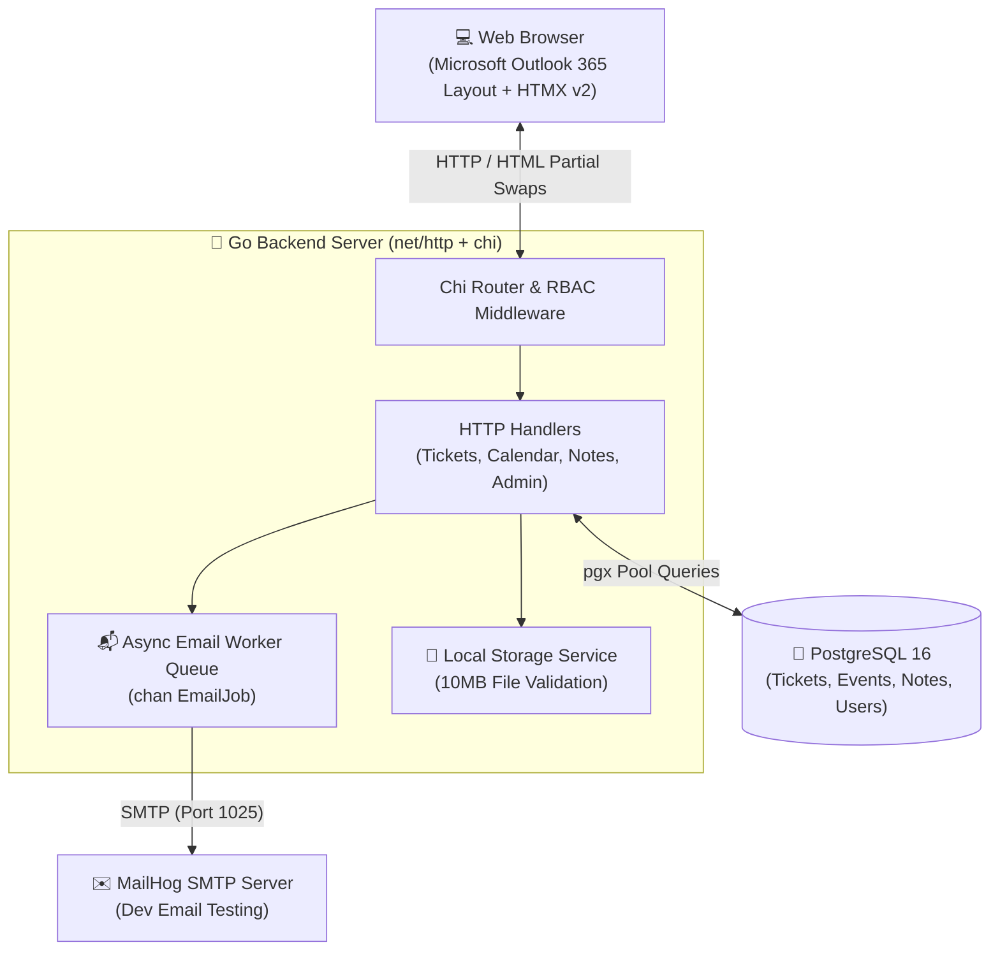

  <h1>⚡ Outlook 365 — ticDesk Workstation</h1>
  
<strong>Enterprise IT Helpdesk, Schedule Calendar & Shift Notes Platform</strong>

  

    Built with <strong>Go 1.22</strong> • <strong>HTMX v2</strong> • <strong>Alpine.js</strong> • <strong>Tailwind CSS</strong> • <strong>PostgreSQL 16</strong>
  

  

    
    
    
    
    
    
  

   

---

## 🌟 Overview

> [!NOTE]
> **ticDesk Outlook 365 Workstation** is a complete, from-scratch redesign modeled directly after **Microsoft Outlook Web (Outlook 365)**. It features an Outlook 365 navigation app rail, a secondary folder pane, an interactive **Schedule Calendar (`/calendar`)**, and a **Shift Notes Scratchpad (`/notes`)** designed for Admins and Support agents to manage maintenance windows, agent shifts, SLA targets, and handoff notes.

### ✨ Microsoft Outlook 365 Features

- 📅 **Outlook Schedule Calendar (`/calendar`)**: Schedule and track server maintenance windows, support shifts, and SLA deadline targets.
- 📝 **Outlook Shift Notes & Scratchpad (`/notes`)**: Sticky notes for support agents & admins to store quick reference IP addresses, credential snippets, and shift handoff checklists with pin/unpin controls.
- ✉️ **Outlook Mail Tickets Inbox (`/tickets`)**: Server-rendered ticket inbox with HTMX v2 zero-reload status, priority, and assignee badge swaps.
- 🛡️ **Double-Barrier RBAC Security**: Role permissions enforced at both HTTP middleware (`RequireRole`) and PostgreSQL repository query filters.
- 📊 **Outlook Today Analytics (`/dashboard`)**: Real-time aggregate metrics for open tickets, in-progress issues, SLA resolution averages, and agent workload.
- 📧 **Outlook HTML Email Notifications**: In-process goroutine worker sending Microsoft Outlook-styled HTML emails via SMTP (MailHog).

---

## 🏗️ System Architecture

---

## 🔐 Role-Based Access Control (RBAC) Matrix

| Action | 👑 Admin | 🛠️ Support | 👤 Customer |
|:---|:---:|:---:|:---:|
| **Create & View Support Tickets** | ✅ | ✅ | ✅ |
| **Manage Outlook Calendar Schedule** | ✅ | ✅ | ❌ |
| **Manage Shift Notes & Scratchpad** | ✅ | ✅ | ❌ |
| **Inline Status & Priority Swaps** | ✅ | ✅ | ❌ |
| **Assign / Reassign Agents** | ✅ | ✅ | ❌ |
| **Post Staff Internal Notes** | ✅ | ✅ | ❌ *(Hidden)* |
| **User & Role Management (`/admin/users`)** | ✅ | ❌ | ❌ |

---

## 🔑 Pre-seeded Test Credentials

| Name | Email Address | Password | Role | Description |
|:---|:---|:---:|:---:|:---|
| **Suvesh** | **`admin@ticdesk.com`** | **`password123`** | `Admin` | System Administrator (Full Access) |
| **Alex Rivera** | **`alex.support@ticdesk.com`** | **`password123`** | `Support` | Customer Support Agent 1 |
| **Sarah Chen** | **`sarah.support@ticdesk.com`** | **`password123`** | `Support` | Customer Support Agent 2 |
| **Test Customer** | **`cust@ticdesk.com`** | **`password123`** | `Customer` | End User / Customer Account |

---

## 🛠️ API & Web Route Sitemap

| Method | Route | Description | Target Page |
|:---:|:---|:---|:---:|
| `GET` | `/dashboard` | Today Overview & Workstation | `dashboard.html` |
| `GET` | `/tickets` | Outlook Mail Ticket Inbox | `ticket_list.html` |
| `GET` | `/calendar` | Outlook Schedule & Calendar | `calendar.html` |
| `POST` | `/calendar/events` | Create Maintenance / Shift Event | `calendar.html` |
| `GET` | `/notes` | Outlook Shift Notes Scratchpad | `notes.html` |
| `POST` | `/notes` | Create Sticky Note | `notes.html` |
| `POST` | `/notes/{id}/pin` | Pin/Unpin Sticky Note | `notes.html` |
| `GET` | `/admin/users` | User & Role Management | `admin_users.html` |

---

  Built with ❤️ by Suvesh • Microsoft Outlook 365 Workstation Engine

